Introduction  {#introduction}
=============

Historical background {#historical-background}
---------------------

Seasonal adjustment (SA) is an important component of the official
statistics business process. This technique is widely used for
estimating and removing seasonal and calendar-related movements from
time series resulting in data that present a clear picture of economic
phenomena. Therefore, Eurostat[^1] takes part in various activities that
aim to promote, develop and maintain a publicly available software
solution for SA in line with established best practices.

Among many seasonal adjustment methods that produce reliable results for
large datasets the most widely used and recommended ones are
X-12-ARIMA[^2]/X-13ARIMA-SEATS[^3] developed at the U.S. Census Bureau
and TRAMO/SEATS[^4] developed by Victor Gómez and Agustín Maravall, from
the Banco de España. Both methods are divided into two main parts. The
first part is called a pre-adjustment. It removes various deterministic
effects from the series by means of a regression model with ARIMA[^5]
noise. The second part is the decomposition of the time series that aims
to estimate and remove a seasonal component from the time series.
TRAMO/SEATS and X-12-ARIMA/X-13ARIMA-SEATS use a very similar approach
in the first part to estimate the same model on the processing step, but
they differ completely in the decomposition step. Therefore, comparing
results from decomposition is often difficult. Furthermore, their
diagnostics focus on different aspects and their outputs take completely
different forms.

The TRAMO/SEATS method was originally implemented in 2001 in the program
TSW (Tramo-Seats-Windows), which is a Windows extension of programs
TRAMO and SEATS. Since then, a considerable amount of changes and
additions have been added, that affect many important input parameters,
as well as the output obtained. These changes resulted in program TSW+
launched in 2014.[^6] A LINUX version of TRAMO-SEATS is also available. 

For X-13ARIMA-SEATS the U.S. Census Bureau provides the Windows
interface called [Win X-13](https://www.census.gov/srd/www/winx13/).[^7]
Distributions of X-13ARIMA-SEATS for Linux and Unix platforms are also
available.[^8]

Both the above seasonal adjustment programs were originally written in
FORTRAN, which is currently recognized as a declining language. The
FORTRAN limitations *–* especially for the creation of reusable
components and for the management of complex problems *–* make the
maintenance of the relevant IT codes increasingly burdensome.

These original seasonal adjustment programs are commonly perceived by
users as difficult to operate. Therefore, to improve access to these SA
methods for non-specialists, Eurostat introduced new software called
Demetra. It offered a user-friendly interface to the two SA algorithms:
TRAMO/SEATS and X-12-ARIMA and facilitated the comparison of the output
from those two algorithms. Even so, Demetra uses the FORTRAN libraries,
which, together with an insufficient product development and handling of
errors, is a factor that caused a rapid decline in software’s usage.

In 2009, the European Statistical System (ESS) launched its ‘*Guidelines
on Seasonal Adjustment*’ [^9]. As Demetra could not be adapted to the
new requirements in the *Guidelines*, Eurostat, in cooperation with the
National Bank of Belgium (NBB), started a project aiming to develop
improved software called Demetra+[^10]. It was released in 2012. This
tool provides a common approach for seasonal adjustment using the
TRAMO/SEATS and X-12-ARIMA methods, which is more coherent with the
*Guidelines*. It includes a unified graphical interface and input/output
diagnostics for the two methods. Demetra+ source code is written in C++
and uses the two original FORTRAN modules, as well as .NET libraries.
Therefore Demetra+ software is non-extensible and cannot be used in IT
environments other than Windows. For these reasons it seems that in
long-term perspective it will not meet users’ expectations.

Therefore, Eurostat took an initiative to create new software that is
based on Demetra+ experience but is platform independent and extensible.
The resulting program is called JDemetra+. The NBB has been developing
it since 2012. From the typical user perspective in comparison with
Demetra+, numerous improvements have been implemented in JDemetra+, in
terms of both layout and functionalities. The most critical innovation
is the re-writing of the original FORTRAN codes of
X-12-ARIMA/X-13ARIMA-SEATS and TRAMO/SEATS in JAVA, following a real
object-oriented approach. These functionalities are discussed in the
next section.

About JDemetra+ {#about-jdemetra}
---------------

JDemetra+ is open source, platform independent, extensible software for
seasonal adjustment (SA) and other related time series problems
developed by the National Bank of Belgium. The tool includes the
TRAMO/SEATS and X-12-ARIMA/X-13ARIMA-SEATS methods and enables the
implementation of the ‘*ESS Guidelines on Seasonal Adjustment*’ (2015).

JDemetra+ offers up-to-date versions of leading seasonal adjustment
algorithms rewritten in Java, which is a crucial factor that enables the
long-term maintenance of the tool, integration of the libraries in the
IT environments of many institutions and re-use of the modules and
algorithms for other purposes. JDemetra+ is not only a user-friendly
graphical interface, comparable to its predecessor, Demetra+, but also a
set of open Java libraries that can be used to deal with time series
related issues including the SA processing of large-scale datasets, the
use of non-standard SA methods, the development of advanced research
modules, temporal disaggregation, benchmarking and business cycle
analysis. JDemetra+ is built around the concepts and the algorithms used
in the two leading SA methods, i.e. TRAMO/SEATS and
X-12-ARIMA/X-13ARIMA-SEATS. They have been re-engineered, following an
object-oriented approach, which allows easier handling, extensions or
modifications.

The most up-to-date version of JDemetra+ is JDemetra+ version [2.2.](http://www.nbb.be/app/dqrd/demetra/demetra1.0.3+.msi)0,
released in July 2017. In comparison with JDemetra+ version [2.1.](http://www.nbb.be/app/dqrd/demetra/demetra1.0.3+.msi)0,
it includes several enhancements resulting from the collaboration
between the developers at the NBB and the group of testers, composed of
the members of the Seasonal Adjustment Centre of Excellence (SACE) and
the Seasonal Adjustment User Group (SAUG):

-   Refreshing the results with a model with fixed parameters;

-   Option for fixing the coefficient of pre-specified regression
    variables

-   Option to use of backcasts in X11;

-   Test for detecting residual calendar effects;

-   The modified Ljung-Box test and the F-test test for detecting a
    residual seasonality;

-   Options to customize the diagnostics and select a set of diagnostics
    in the matrix view.

JDemetra+ version [2.2.](http://www.nbb.be/app/dqrd/demetra/demetra1.0.3+.msi)0 is
based on the following core engines:

-   TramoSeats dlls, dated 10/2014;

-   X12 dll (developed by the U.S. Census Bureau, based on X-12-ARIMA
    version 0.3, dated 12/2010).

One of the strategic choices for JDemetra+ is to provide common
presentation/analysis tools for the seasonal adjustment methods
included, so that the results from different methods can easily be
compared. Obviously, JDemetra+ is highly influenced by the output of
TRAMO/SEATS and of X-12-ARIMA/X-13ARIMA-SEATS. Most analyses implemented
in JDemetra+ are available in the core engines. However, the results
produced by JDemetra+ may slightly differ for several reasons (different
statistical/algorithmic choices). In any case the global messages from
seasonal adjustment are (nearly) always similar.

Among numerous important tools implemented in JDemetra+, the following
functionalities should be highlighted:

-   RegARIMA modelling (using concepts developed in TRAMO and in
    X-12-ARIMA);

-   Residuals analysis (mostly TRAMO-like);

-   Seasonality tests (TRAMO and X-12-ARIMA-like);

-   Spectral analysis (X-12-ARIMA definition);

-   Sliding spans (X-12-ARIMA);

-   Wiener-Kolmogorov analysis (for unobserved ARIMA components model,
    SEATS-like).

JDemetra+ is written using object-oriented programming (OOP)
methodology. It allows developers to design software in a modular way,
i.e. separate the functionality of an application into independent,
interchangeable modules. Such units provide a specific group of
functionalities and can be detached from the whole concept. The
object-oriented approach is especially useful in the case of complex
programs or when reusability matters.

Beside the statistical algorithms, JDemetra+ provides numerous
peripheral services. The most important ones are the following:

-   Dynamic access to various "time series providers": JDemetra+
    provides modules to handle time series from different sources:
    Excel, databases (through JDBC), WEB services, files (TXT, TSW,
    USCB, XML, SDMX,...); the access is dynamic in the sense that time
    series are automatically refreshed, which consults the providers to
    download new information. The model allows asynchronous treatment.

-   Common XML formatting: the seasonal adjustment processing can be
    saved in XML, which could also be used to generate WEB services
    around seasonal adjustment.

The graphical interface of JDemetra+ is based on the framework
NetBeans[^11]. Thanks to that technology external IT teams can create
their own modules to enrich original software without modifying the core
application. The main features that can be enriched are listed below:

-   Time series providers: the users could add their own modules to
    download series from other databases;

-   Diagnostics on seasonal adjustment;

-   Output of SA processing.

As mentioned above, the API could be used to generate completely
independent applications, but also to create, more easily, extensions to
the current application.

One of the aims of JDemetra+ was to develop software that enables the
comparison of the result from TRAMO/SEATS and
X-12-ARIMA/X-13ARIMA-SEATS. For this reason, most of the analysis tools
are common to both algorithms, e.g. the revision history and the sliding
spans, even if they were originally developed in only one of them. On
the other hand, all the features developed in the original programs have
not always been implemented in JDemetra+; for instance, by contrast with
TRAMO/SEATS, JDemetra+ does not separate the long-term trend from the
cycle.

JDemetra+ runs on operating systems that support the Java VM (Virtual
Machine) such as:

-   Microsoft Windows Vista SP1/Windows 7/8;

-   Ubuntu 9.10;

-   Solaris OS version 11 Express (SPARC and x86/x64 Platform Edition);

-   Macintosh OS X 10.6 Intel.

JDemetra+ runs on the Java SE Runtime Environment (JRE) version 8 update
21 or later. JRE can be downloaded to the user’s platform from one of
the sites listed below:

-   Windows, Linux and Solaris:
    > http://www.oracle.com/technetwork/java/javase/downloads/index.html

-   Mac OS X: http://support.apple.com/downloads for Mac OS X 10.6
    > http://www.oracle.com/technetwork/java/javase/downloads/index.html
    > for OS X Lion 10.7.

    ### Installing and uninstalling JDemetra+ {#installing-and-uninstalling-jdemetra}

JDemetra+ is a stand-alone application packed in a zip package. It is
accessible from *Collaboration in research and methodology for official
statistics* webpage ([www.cros-portal.eu](http://www.cros-portal.eu/)).

Once downloaded to the PC it can be extracted to any folder on your
system. The archive contains two versions of executable file (32-bit
version and 64-bit version). The user should execute the version that
matches the system version. The executable file is located in the
appropriate nbdemetra/bin directory.

If the launching of JDemetra+ fails, you can try the following
operations:

-   Check if Java SE Runtime Environment (JRE) is properly installed by
    > typing in the following command in a terminal: *java --version*

-   Check the logs in your home directory:

    -   %appdata%/.nbdemetra/dev/var/log/ for Windows;

    -   \~/.nbdemetra/dev/var/log/ for Linux and Solaris;

    -   \~/Library/Application Support/.nbdemetra/dev/var/log/ for Mac
        > OS X.

In order to remove a previously installed JDemetra+ version, the user
should delete an appropriate JDemetra+ folder.

### Running JDemetra+ {#running-jdemetra}

To open an application, navigate to the destination folder and double
click on *nbdemetra.exe* or *nbdemetra64.exe* depending on the system
version (*nbdemetra.exe* for the 32-bit system version and
*nbdemetra64.exe* for the 64-bit system version).

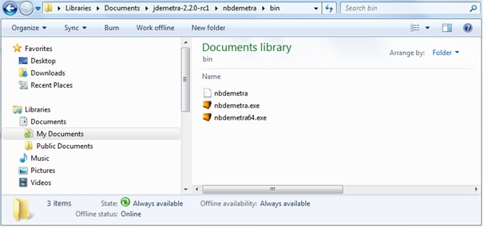

Figure 1.1: Running JDemetra+.

### Closing JDemetra+ {#closing-jdemetra}

To close the application, select *File → Exit* from the main menu (See
Chapter 3).

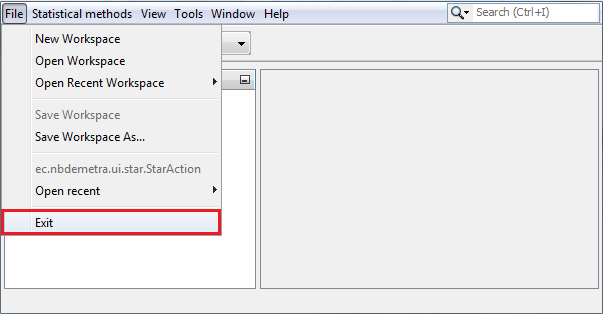

Figure 1.2: Closing JDemetra+.

The other way is to click on the close box in the upper right-hand
corner of the JDemetra+ window. If there is any unsaved work, JDemetra+
will display a warning and provide the user with the opportunity to save
it. The message box is shown below.

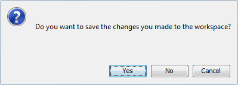

Figure 1.3: The warning from leaving JDemetra+ without saving the
workspace.

About JDemetra+ Reference Manual {#about-jdemetra-reference-manual}
--------------------------------

The ‘*JDemetra+ Reference Manual*’ (2017) aims to introduce the user to
the main features of JDemetra+ software and assist the user to take
advantage of this powerful tool. The ‘*JDemetra+ Reference Manual*’
(2017) presents an overview of the capabilities of the software and
includes detailed documentation on all of the specifications, with
discussions of the available arguments and their default values. Also
the results displayed by JDemetra+ are elaborated. Step-by-step
descriptions of how to perform a typical analysis and useful tips that
facilitate replication of the results with the user’s own data and
working instructions are included in a separate document, namely the
‘*JDemetra+ User Guide*’ (2017).

JDemetra+ uses the notation "X12", "X13","Arima", "RegArima", "Tramo",
"Seats" and "TramoSeats" instead of "X-12-ARIMA", "X-13ARIMA-SEATS",
"ARIMA", "RegARIMA", "TRAMO", "SEATS" and "TRAMO/SEATS" respectively.
This notation is also used in the ‘*JDemetra+ Reference Manual*’ (2017)
only when the references to the user interface are made.

### Users to whom this document is intended {#users-to-whom-this-document-is-intended}

The ‘*JDemetra+ Reference Manual*’ (2017) can be used by beginners, i.e.
those who have only basic knowledge about the idea of seasonality and
its estimation in time series, as well as by users who have already
acquired some experience from seasonal adjustment using relevant
software and are able to interpret the outcomes, at least on a basic
level.

This document does not describe the detailed working of the seasonal
adjustment methods, nor the underlying mathematics. It assumes that the
reader has acquired a background knowledge on the concept of seasonal
adjustment and is familiar with the X-12-ARIMA, the X-13ARIMA-SEATS and
the TRAMO/SEATS methods. A brief outline of the X-12-ARIMA, the
X-13ARIMA-SEATS and the TRAMO/SEATS algorithms and concepts is included.
For readers interested in studying the seasonal adjustment methods
further, a bibliography is provided in Chapter 10.

It is assumed that the reader is familiar with concepts, such as
*stochastic and* *deterministic processes,* *time series*,
*trend-cycle*, *seasonality*, *descriptive statistics*, *confidence
level*, *mean square error*, *estimate*, *estimator*, *linear
regression, stationarity*, *ARIMA process* and so on. Readers with
insufficient background to follow this document are encouraged to refer
to an appropriate textbook, e.g. CHATFIELD (2004). Some background
knowledge about seasonality in the time series can be gained from the
e-learning courses on seasonal adjustment that are available at [http://www.sa-elearning.eu/](http://www.sa-elearning.eu/).

### How the document is organised {#how-the-document-is-organised}

The ‘*JDemetra+ Reference Manual*’ (2017) is divided into seven parts,
including an introduction and Annex. The first two parts are designed to
provide the user with necessary information about software and this
document. The next chapters explore JDemetra+ capabilities and focus on
functionalities that refer to the particular types of actions. They are
further divided according to specific elements of the subject.

General information about JDemetra+ including an installation procedure
is presented in Chapter 1. It also informs about the prerequisites and
intended user’s profile.

Chapter 2 gives an overview of the software and explains the purpose of
the main windows.

Chapter 3 discusses application menu and presents the available options.

An overview of the modelling features from the *Workspace* window is the
focus of Chapter 4. It explains the options for the modelling
specifications, explores the modelling facilities with TRAMO and
RegARIMA models and gives insights into the output.

Chapter 5 discusses the options for the seasonal adjustment
specifications and presents in detail the seasonal adjustment results
from the pre-defined and user-defined specifications.

Chapter 6 elaborates on the calendars in JDemetra+ and user-defined
regression variables. Both functionalities are designed to enhance the
modelling capabilities of JDemetra+ and provide a better input for the
decomposition stage.

Annex describes selected aspects of the seasonal adjustment methods and
technical issues including descriptions of the theoretical models used
by X-12-ARIMA and TRAMO/SEATS. These descriptions of the seasonal
adjustment related concepts are vital for a good understanding of the
results produced by the software.

Main application windows {#main-application-windows}
========================

The default JDemetra+ window, which is displayed after launching the
program, is clearly divided into several panels.

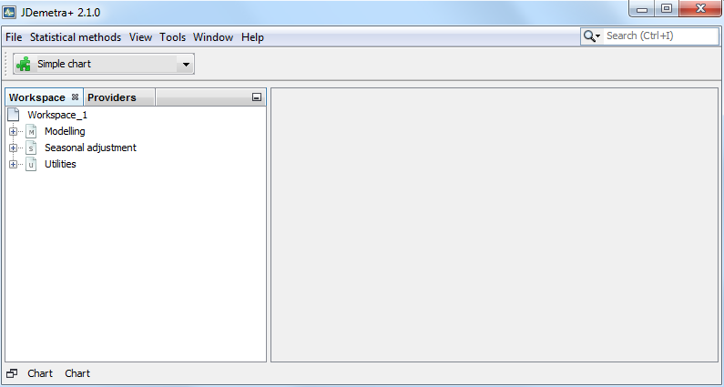

Figure 2.4: JDemetra+ default view.

The key parts of the user interface are:

-   The *Providers* window, which organises time series;

-   The *Workspace* window, which stores results generated by the
    software as well as settings used to create them;

-   A central empty zone for presenting the actual analyses further
    called the *Results* panel.

> These areas are described in the next sections.

Providers {#providers}
---------

The *Providers* window presents the list of the data sources and
organises the imported series within each data provider.

Figure 2.5: The *Providers* window.

The allowed data sources include:

-   JDBC;

-   ODBC;

-   SDMX;

-   Spreadsheets;

-   TSW;

-   TXT;

-   USCB;

-   XML.

All standard databases (Oracle, SQLServer, DB2, MySQL) are supported by
JDemetra+ via JDBC, which is a generic interface to many relational
databases. Other providers can be added by users by creating plugins
(see item 3.4.6). To import data, right-click on the appropriate
provider from the *Providers* panel and specify the required parameters.
For all providers the procedure follows the same logic. The requirements
for each of these data sources as well as the importing procedure are
discussed in the ‘*JDemetra+ User Guide*’ (2017), item 2.1.2.

The *Providers* window organises data in a tree structure reflecting the
manner in which data are presented in the original source. The picture
below presents how JDemetra+ visualises the imported spreadsheet file.
If the user expands all the pluses under the spreadsheet all the series
within each sheet that has been loaded are visible. Here two time series
are visible: *Japan* (under the *Asia* branch) and *United States*
(under the *North America* branch) while the *Europe* branch is still
folded. The names of the time series have been taken from the column
headings of the spreadsheet while the names of the branches come from
sheets’ names.

> 

Figure 2.6: Dataset structure.

Series uploaded to the *Providers* window can be displayed (see
‘*JDemetra+ User Guide*’ (2017), item 2.1.4), modified and tested (see
‘*JDemetra+ User Guide*’ (2017), item 3.4) and used in estimation
routines (Chapters 4 and 5). The data sources can be restored after
re-starting the application so that there is no need to fetch them
again. This functionality can be set in the *Behaviour* tab available at
the *Option* item from the *Tools* menu.

Workspace {#workspace}
---------

Workspace is a JDemetra+ functionality that stores the work performed by
the user in a coherent and structured way. By default, each workspace
contains the pre-defined modelling and seasonal adjustment
specifications and a basic calendar. A specification is a set of
modelling and/or seasonal adjustment parameters.

Within the workspace the following items can be saved:

-   User-defined modelling and seasonal adjustment specifications;

-   Documents, that contain results from time series modelling and
    seasonal adjustment;

-   User-defined calendars;

-   User-defined regression variables.

Together with the results from modelling and seasonal adjustment, also
the original data, paths to the input files and parameters of processes
are saved. Therefore, these results can be re-opened, updated,
investigated and modified in the next sessions with JDemetra+.

The workspace saved by JDemetra+ includes:

-   Main folder containing several folders that correspond to the
    different types of items created by the user and;

-   The xml file that enables the user to import the workspace to the
    application and to display its content.

An example is shown in Figure 2 .7.

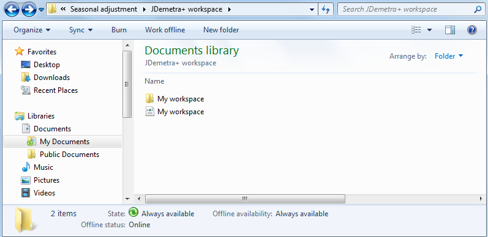

Figure 2.7: The workspace saved on PC.

The workspace can be shared with other users, which eases the burden of
work with defining specifications, modelling and seasonal adjustment
processes.

The content of the workspace is presented in the *Workspace* window
(Figure 2.5). It is divided into three sections: *Modelling, Seasonal
adjustment* and *Utilities*. The window organises all default and
user-defined specifications (item 4.1 for the modelling specifications
and item 5.1 for the seasonal adjustment specifications), documents,
which contain the results of the respective processes (item 4.2 for the
modelling documents and item 5.2 for the seasonal adjustment documents),
calendars (item 6.1) and user defined variables (item 6.2).

Figure 2.8: The *Workspace* window.

Results panel {#results-panel}
-------------

The empty zone on the right is a place where JDemetra+ displays various
windows (Figure 2.6). More than one window can be displayed at the same
time. Windows can overlap each other with the foremost window being in
focus or active. The active window has a darkened title bar. The windows
in the results panel can be arranged in many different ways, depending
on the user’s needs (item 3.5). The example below shows one of the
possible views of this panel. The results of the user’s analysis are
displayed in the respective windows. The picture below shows two panels
– a window containing seasonal adjustment results (upper panel) and the
other one containing an autoregressive spectrum (lower panel).

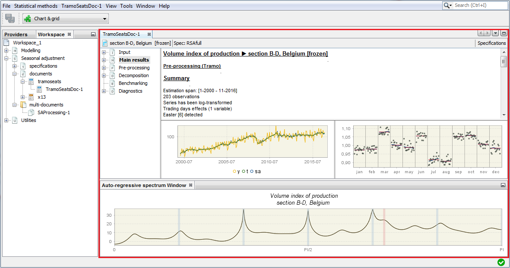Figure
2.9: The *Results* panel filled with two windows.

Application menu {#application-menu}
================

The majority of functionalities are available from the main menu of the
application, which is situated at the very top of the main window. If
the user moves the cursor to an entry in the main menu and clicks on the
left mouse button, a drop-down menu will appear. Clicking on an entry in
the drop-down menu selects the highlighted item.

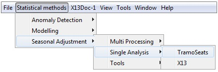

Figure 3.10: The main menu with selected drop-down menu.

The functions available in the menu of the application are elaborated
further in this chapter.

File {#file}
----

The *File* menu is intended to create new workspaces, to open existing
workspaces and datasets and fort saving new/updated workspaces.

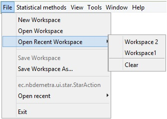

Figure 3.11: The content of the *File* menu.

It offers the following functions:

-   **New Workspace** – creates a new workspace and displays it in the
    *Workspace* window with a default name (*Workspace\_\#number*);

-   **Open Workspace** – opens a dialog window, which enables the user
    to select and open an existing workspace;

-   **Open Recent** **Workspace** – presents a list of workspaces
    recently created by the user and enables the user to open one of
    them;

-   **Save Workspace** – saves the project file named by the system
    under the default name (*Workspace\_\#number*) and in a default
    location. The workspace can be re-opened at a later point in time;

-   **Save Workspace As…** – saves the project file named by the user in
    the chosen location. The workspace can be re-opened at a later point
    in time;

-   **Open Recent** – presents a list of datasets recently used and
    enables the user to open one of them;

-   **Exit** – closes an application.

    Statistical methods {#statistical-methods}
-------------------

The *Statistical methods* menu includes functionalities for modelling,
analysis and seasonal adjustment of a time series. They are divided into
three groups:

-   **Anomaly Detection** – allows for a purely automatic identification
    of regression effects;

-   **Modelling** – enables time series modelling using the TRAMO and
    RegARIMA models;

-   **Seasonal adjustment** – intended for seasonal adjustment of the
    time series with the TRAMO/SEATS and X-13ARIMA-SEATS methods.

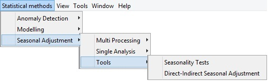

Figure 3.12: The *Statistical methods* menu.

### Anomaly Detection {#anomaly-detection}

The primary goal of functionalities that are available in the *Anomaly
Detection* section is an identification of atypical values called
outliers. According to the ‘*ESS Guidelines on Seasonal Adjustment*’
(2015), seasonal adjustment methods are likely to be severely affected
by the presence of such values; therefore they should be detected and
replaced simultaneously or before estimating the seasonal and calendar
components in order to avoid a distorted or biased estimation.

The use of the RegARIMA models is recommended by the ‘*ESS Guidelines on
Seasonal Adjustment*’ (2015) to estimate and remove outliers before
estimating the seasonal effect. As the presence of outliers could
strongly affect the quality of the decomposition, the various types of
outlier (i.e. additive outliers, transitory changes, level shifts, etc.)
should be detected and corrected for.

The quality control should be performed each time new or revised data
become available. The manual inspection of the data is problematic,
especially in the case of large databases. Moreover, it usually relies
on some simple measures, which do not consider the full information
contained in the series, but just a few values. Therefore the results
can be strongly affected by seasonality, noise, or special events.

JDemetra+ includes two tools dedicated for automatic identification of
outliers: *Check Last* and *Outliers Detection*. Both are based on the
TERROR program, which is an application of TRAMO, executed in an
automatic manner (with several possible options to set) to the problem
of quality control in time series for automatic detection of errors in
time series. Therefore, both tools use the TRAMO specifications.

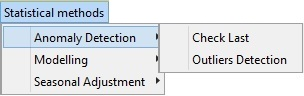

Figure 3.13: The *Anomaly detection* menu.

#### Check Last {#check-last}

The *Check Last* tool automatically detects the TRAMO model, forecasts
up to three last observations and marks the observations that are too
different from their forecasted values. The *Check Last* *Batch* window
is divided into three panels. The panel on the left presents the list of
analysed series. The results are dispalyed in the panels on the right.

To launch the analysis, drag and drop the series from the *Providers*
window into the left hand side panel of the *Check Last Batch* window
and click the *Start* button (denoted with the green arrow) from the
menu in the top part of the window. The analysis will be performed using
the TRAMO speciation selected from the list. By default, TR4 is used.

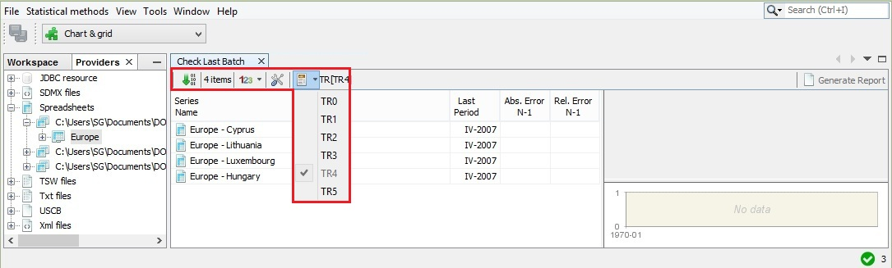

Figure 3.14: The *Check Last* initial window with series to be processed
and the list of available specifications expanded.

JDemetra+ removes the last observations from the series and calculates a
one-period-ahead out-of-sample forecast of the series. The forercasted
values are then compared with the actual values. The user may decide how
many of the last observations will be considered (one, two, or three) in
this procedure (click on the *123* button and specify the number). The
number of columns visible in the panel on the left is adjusted
accordingly to the user choice.

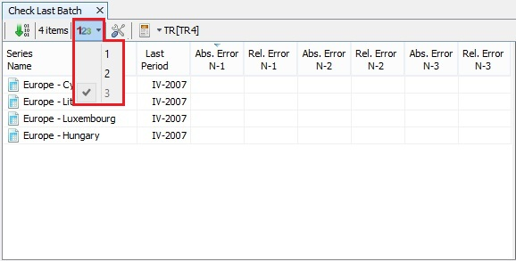

Figure 3.15: The options for number of observations to be examined.

The default settings can be changed in the *Properties* dialog box (the
number of last observations that will be compared to the forecasted
values, specification used for modelling and the threshold values used
to decide if observation is abnormal). To open it, click on the button
marked with the working tools.

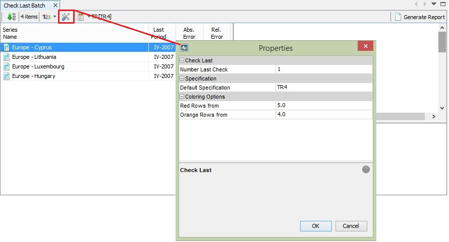

Figure 3.16: The properties for the *Check Last* functionality.

Once the process is executed, click on the series on the list to display
the results. For each series the program automatically identifies an
ARIMA model, detects several types of outliers, interpolates missing
values and estimates the calendar effects, if appropriate. Study the
detailed results section using the vertical scrollbar.

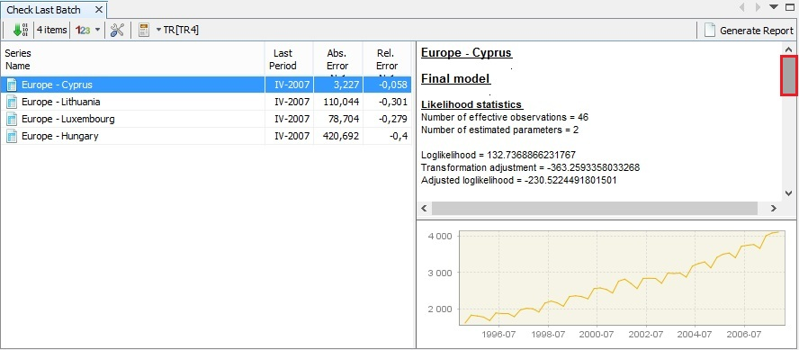

Figure 3.17: The results of the outlier’s detection process.

The last observations (one, two or three, depending of the user’s
choice) are compared with the forecasted values. If, for a given
observation, the forecast error divided by a standard deviation of
residuals is greater than the first threshold value and lower than the
second threshold value, then this observation is classified as
containing a "possible error" and marked in orange. If this value is
greater than the second threshold value, then the new observation is
classified as containing a "likely error" and marked in red. Otherwise,
the observation is accepted as without error[^12].

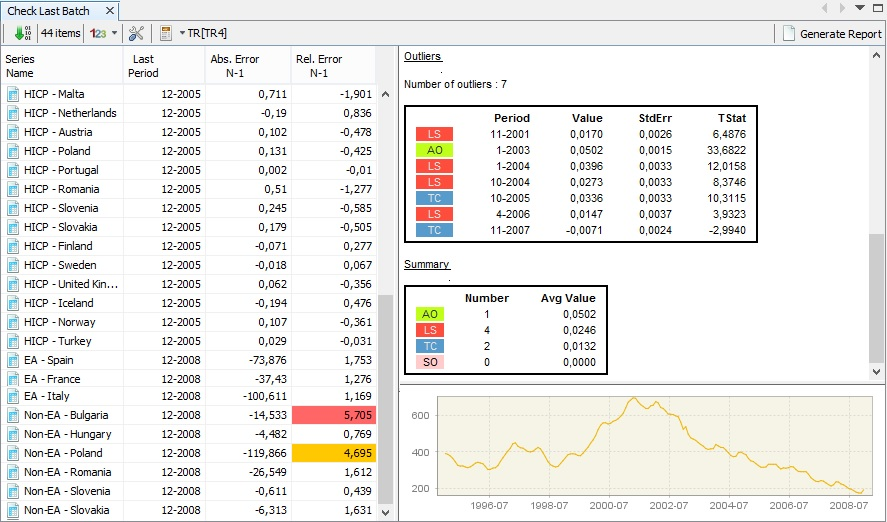

Figure 3.18: Investigation of the outliers’ detection results.

JDemetra+ enables the user to save the results of this analysis in the
compact form of the report. To generate it, click on the **Generate
Report** button and specify the sorting options.

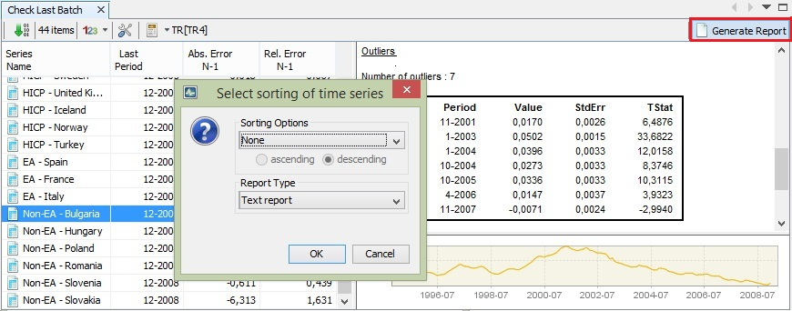

Figure 3.19: The *Generate Report* functionality.

To save the report click **OK** and select a destination folder.

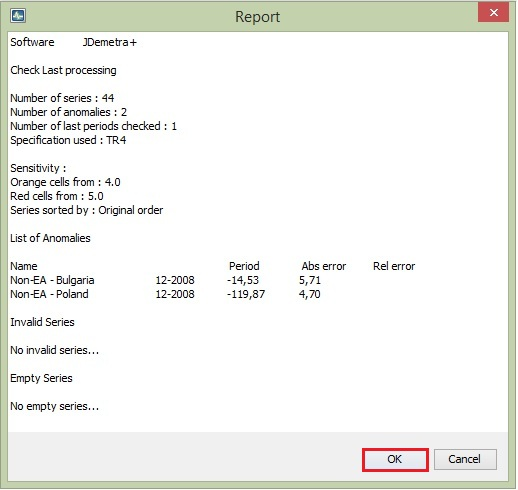

Figure 3.20: Report from the outliers’ detection process.

#### Outlier detection {#outlier-detection}

The *Outlier Detection* tool allows for an identification of an ARIMA
model, including detection of outliers, interpolation of missing values
and estimation of calendar effects. The assessment of the last
observations’ quality is not performed. Instead, the outliers are
highlighted in green (transitory changes), red (level shifts), blue
(additive outliers) and violet (seasonal outliers). By default the
seasonal outliers are not considered. The user may change this setting
in the *Properties* menu.

A step-by-step demonstration of the *Outlier Detection* tool
capabilities can be found in the ‘*JDemetra+ User Guide*’ (2017), item
3.3.1.

### Modelling {#modelling}

The aim of the *Modelling* section is to provide tools for time series
modelling and forecasting without performing the estimation of the
components and decomposition. The estimation results can be useful for
time series analysis and prediction of a short-term development.

The *Modelling* section includes all capabilities from the TRAMO and
RegARIMA models. It is flexible in specifying model parameters. The
results can be saved and refreshed with updated series. Instructions on
how to use this functionality is given in the ‘*JDemetra+ User Guide*’
(2017), item 3.3.2.

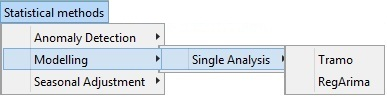

Figure 3.21: The *Modelling* menu.

### Seasonal Adjustment {#seasonal-adjustment}

The *Seasonal Adjustment* section provides tools to perform seasonal
adjustment for a single time series as well as for the multiple time
series using the TRAMO/SEATS or X-13ARIMA-SEATS methods. It also offers
several seasonality tests that can be used to scrutinize the presence
and the nature of seasonal movements in time series independently from
seasonal adjustment. Finally, the *Direct-Indirect Seasonal Adjustment*
tool enables for a comparison of the results from direct and indirect
seasonal adjustment performed for the aggregated series.

The guidance for using these functionalities is given in the ‘*JDemetra+
User Guide*’ (2017) (basic scenario that allows for generating seasonal
adjustment in an automatic way is presented in 3.1, different types of
user interventions are discussed in 3.2, the *Seasonality Tests* tool is
explained in 3.4.1 while the capabilities of *Direct-Indirect Seasonal
Adjustment* are shown in 3.2.1.8).

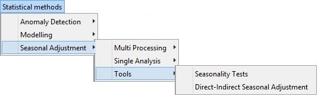

Figure 3.22: The *Seasonal Adjustment* menu.

View {#view}
----

The *View* menu contains functionalities allowing for customising the
view of an application to the user needs. It offers the following items:

-   **Split** – the function is not operational in the current version
    of the software.

<!-- -->

-   **Toolbars** – displays selected toolbars under the main menu. The
    *File* toolbar contains the *Save all* icon. The *Performance*
    toolbar includes two icons: one to show the performance of the
    application, the other to stop application profiling and take a
    snapshot. The *Other* toolbar determines the default behaviour of
    the program when the user double clicks on the data. It may be
    useful to plot the data, visualise it on a grid, or to perform any
    pre-specified action, e.g. execute a seasonal adjustment procedure.

<!-- -->

-   **Show Only Editor** – displays only the *Results* panel and hides
    other windows (e.g. *Workspace* and *Providers*).

-   **Full Screen** – displays the current JDemetra+ view in the full
    screen.

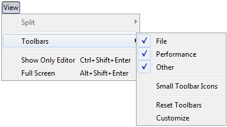

Figure 3.23: The *View* menu.

Tools {#tools}
-----

The *Tools menu* includes, among other functionalities, tools which are
helpful for a graphical analysis of the time series. The
‘*X-13ARIMA-SEATS Reference Manual*’ (2015) strongly recommends studying
a high resolution plot of the time series as it is helpful to get
information about e.g. seasonal patterns, potential outliers and
stochastic non-stationarity. Also the ‘*ESS Guidelines on Seasonal
Adjustment*’ (2015) recommend carrying out a graphical analysis on both
unadjusted data and the initial run of the seasonal adjustment software.
In particular, the graphical analysis should consider:

-   The length of the series and a model span;

-   The presence of zeros, outliers or problems in the data;

-   The structure of the series: presence of a long term and cyclical
    movements, of a seasonal component, volatility etc.;

-   The presence of possible breaks in the seasonal behaviour;

-   The decomposition scheme (additive, multiplicative).

The ‘*ESS Guidelines on Seasonal Adjustment*’ (2015), recommend that
this exercise should be performed and documented for the most important
series to be adjusted at least once a year.

The following functionalities are available from the *Tools* menu:

-   **Container** – includes several tools for displaying data in a time
    domain;

-   **Spectral analysis** – contains tools for analysis of time series
    in a frequency domain;

-   **Aggregation** – enables the user to investigate the graph of the
    sum of multiple time series;

-   **Differencing** – allows for inspection the first regular
    differences of the time series;

-   **Spreadsheet profiler** – offers the Excel-type view of the XLS
    file imported to JDemetra+.

-   **Plugins** – allows the installation and activation of plugins,
    which extend JDemetra+ functionalities.

-   **Options** – presents the default interface settings and allows for
    their modification.

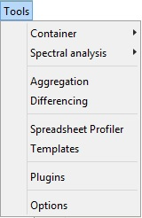

Figure 3.24: The *Tools* menu.

### Container {#container}

*Container* includes basic tools to display the data. The following
items are available: *Chart*, *Grid*, *Growth Chart* and *List*.

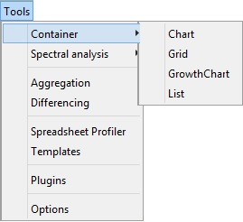

Figure 3.25: The *Container* tools.

Several containers can be opened at the same time. Each of them may
include multiple time series.

*Chart* plots the time series as a graph. This function opens an empty
window. To display a given series drag and drop the series from the
*Providers* window into it. More than one series can be displayed on one
graph. The chart is automatically rescaled after adding a new series.

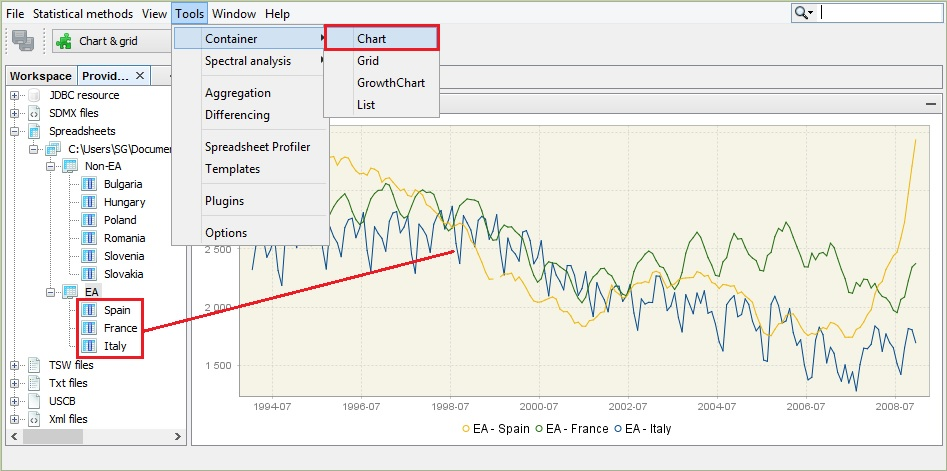

Figure 3.26: Launching the *Chart* functionality.

The series to display can be also dragged from the other windows (e.g.
from the *Variables* window) or directly from the windows that display
the results of the estimation procedure.

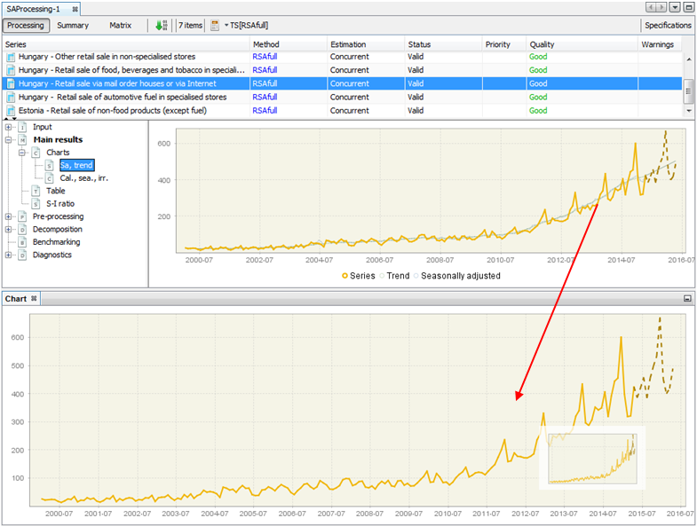

Figure 3.27: Displaying the seasonally adjusted series on a separate
chart.

To adjust the view of the chart and save it in a given location use the
local menu, which is displayed after right-clicking on the chart. The
explanation of the functions available for the local menu is given below
Figure 3 .29.

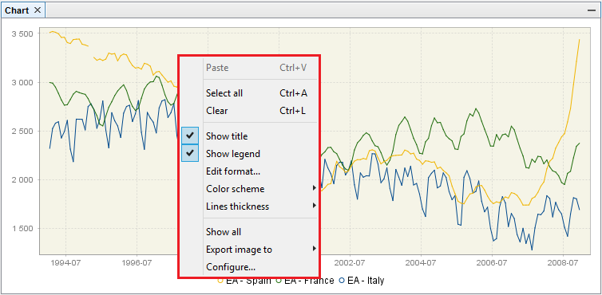

Figure 3.28: Local menu basic options for the time series graph.

To display the time series value at a given date, hover over it with the
cursor. Once the time series is selected by clicking on it with the
right mouse button, the options dedicated to this series are available.

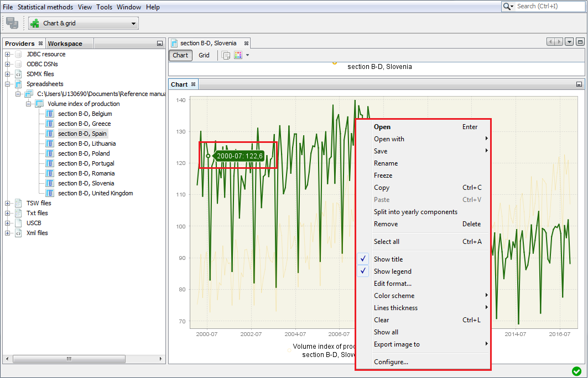

Figure 3.29: Local menu options for chart.

A list of possible actions includes:

-   **Open** – opens selected time series in the new window that contain
    *Chart* and *Grid* panels.

-   **Open with** – opens the time series in a separate window according
    to the user choice (*Chart* *& grid* or *Simple chart*). The *All ts
    views* option is not currently available.

-   **Save** – saves the marked series in a spreadsheet file or in a
    text file.

-   **Rename** – enables the user to change the time series name.

-   **Freeze** – disables modifications of the chart.

-   **Copy** – copies series and allows it to be pasted to another
    application e.g. into Excel.

-   **Paste** – pastes the time series previously marked.

-   **Split into yearly components** – opens a window that presents the
    analysed series data split by year. This chart is useful to
    investigate the differences in time series values caused by the
    seasonal factors as it gives some idea about the existence and size
    of the deterministic and stochastic seasonality in data.

-   **Remove** – removes a time series from the chart.

-   **Select all** – selects all time series presented in the graph.

-   **Show title** – option is not currently available.

-   **Show legend** – displays names of all time series presented on the
    graph.

-   **Edit format** – enables the user to change a data format.

-   **Color scheme** – allows the colour scheme used in the graph to be
    changed.

-   **Lines thickness** – allows the user to choose between thin and
    thick lines to be used for a graph.

-   **Clear** – removes all time series from the chart.

-   **Show all** – this option is not currently available.

-   **Export image to** – allows the graph to be sent to the printer and
    saved as clipboard or as a file in the jpg format.

-   **Configure** – enables the user to customize a chart and a series
    display.

Some of these options are investigated further in the ‘*JDemetra+ User
Guide*’ (2017), 2.1.4.

*Grid* enables the user to display the selected time series as a table.
This function opens an empty window. To display a given series drag and
drop the series from the *Providers* window into it. More than one
series can be displayed in one table.

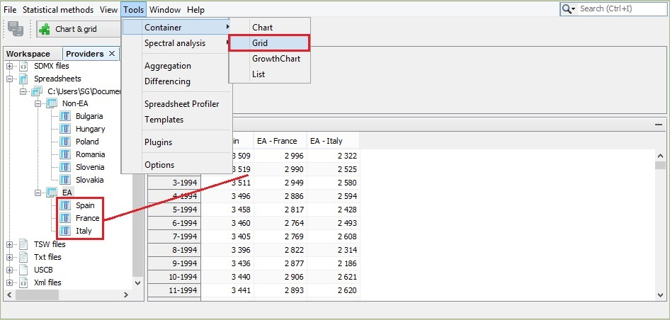

Figure 3.30: Launching the *Grid* functionality.

To display options available for a given time series, left click on any
time series’ observation.

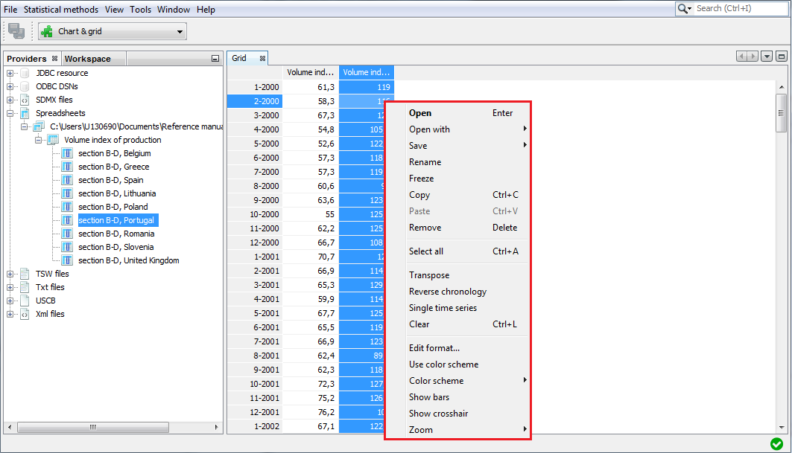

Figure 3.31: Local menu options for the *Grid* view.

Options that are characteristic for *Grid* are:

-   **Transpose** – changes the orientation of the table from horizontal
    to vertical.

-   **Reverse chronology** – displays the series from the last to the
    first observation.

-   **Single time series** – removes from the table all time series
    apart from the selected one.

-   **Use color scheme** – allows the series to be displayed in colour.

-   **Show bars** – presents values in a table as horizontal bars.

-   **Show crosshair** – highlights an active cell.

-   **Zoom** – option for modifying the chart size.

The explanation of other options can be found below Figure 3 .29.

When none of the series is selected, the local menu offers a reduced
list of options. The explanation of the functions available for the
local menu is given below Figure 3 .29.

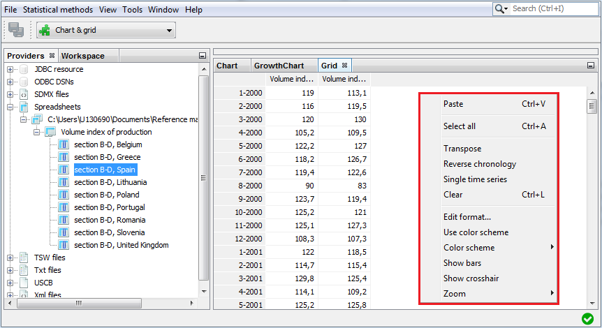Figure
3.32: A reduced list of options for *Grid*.

*Growth chart* opens an empty window. Once a given series is dropped
into it, *Growth chart* presents year-over-year or period-over-period
growth rates for selected time series. More than one series can be
displayed in one table. The growth chart is automatically rescaled after
adding a new series.

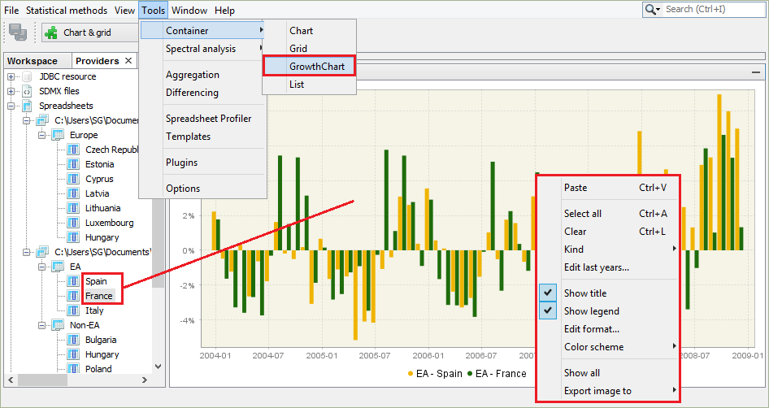

Figure 3.33: The *Growth chart* view with a local menu.

Left click displays the local menu with available options. These that
are characteristic for *Growth chart* are:

-   **Kind** – displays m/m (or q/q) and y/y growth rates for all time
    series in the chart (previous period and previous year options
    respectively). By default, the period-over-period growth rates are
    shown.

-   **Edit last year** – for clarity and readability purposes, only five
    last years of observations are shown by default. This setting can be
    adjusted to the user needs in the *Options* section (see 3.4.7).

The explanation of other options can be found below Figure 3 .29.

*List* provides basic information about chosen time series, like the
start and end date, the number of observations and a sketch of data
graph. This function opens an empty window. To display information, drag
and drop the series from the *Providers* window into the *List* window.
Right click displays the local menu with all available options. Apart
from the standard options, the local menu for *List* enables marking the
series that match the selected frequency (yearly, half-yearly,
quarterly, monthly) using the *Select by frequency* option. The
explanation of other options can be found below Figure 3 .29.

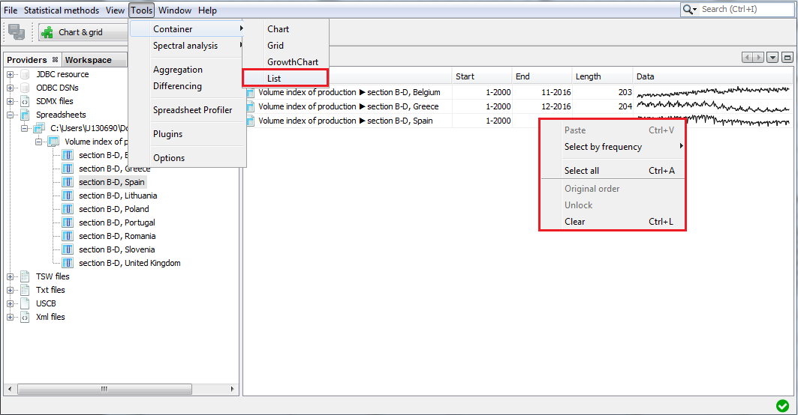

Figure 3.34: A view of a list of series.

For a selected series a local menu offers an extended list of options.
The explanation of the functions available for the local menu is given
below Figure 3 .29.

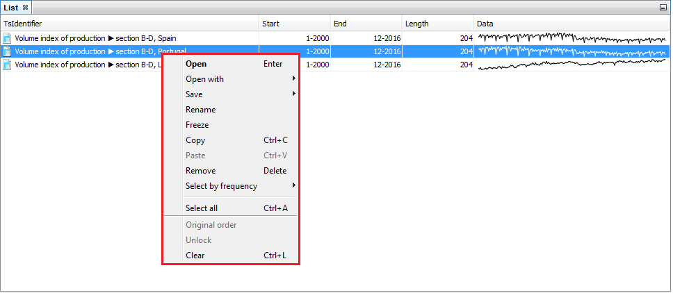**Figure**
**3.**35**: Options available for a selected series from the list.**

### Spectral analysis {#spectral-analysis}

The *Spectral analysis* section provides three spectral graphs for an
in-depth analysis of time series in the frequency domain. These graphs
are *Auto-regressive Spectrum*, *Periodogram* and *Tukey Spectrum*.
Brief information on a spectral analysis is given in 7.3. A detailed
presentation of the abovementioned tools can be found in the ‘*JDemetra+
User Guide*’ (2017), item 3.4.2.

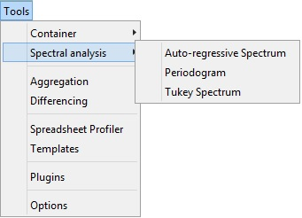

Figure 3.36: Tools for spectral analysis.

### Aggregation {#aggregation}

*Aggregation* calculates the sum of the selected series and provides
basic information about the selected time series, including the start
and end date, number of observations and a sketch of the data graph, in
the same way as the *List* functionality. *Aggregation* opens an empty
window. To sum the selected series, drag and drop them from the
*Providers* window into the *Aggregation* window. Right click displays
the local menu with available options. The content of the local menu
depends on the panel chosen (a panel on the left that contains the list
of the series and a panel on the right that presents the graph of an
aggregate). The local menu for the list of series offers the option
*Select by frequenc*y, which marks all the series on the list that are
yearly, half-yearly, quarterly or monthly (depending on the user’s
choice). The explanation of the other options can be found below Figure
3 .29. The local menu for the panel on the left offers functionalities
that are analogous to the ones that are available for the *List*
functionalities, while the options available for the local menu for the
panel on the left are the same as the ones available for *Chart* (see
3.4.1).

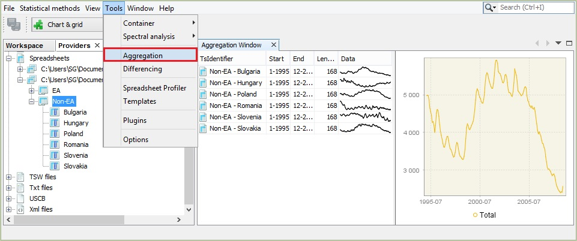

Figure 3.37: The *Aggregation* tool.

### Differencing {#differencing}

The *Differencing* window displays the first regular differences for
selected time series together with the corresponding periodogram and the
PACF function. By default, the window presents the results for
non-seasonally and seasonally differenced series
\\(\left( d = 1,D = 1 \right)\\). These settings can be changed through
the *Properties* window (*Tools* *→ Properties*). Some explanations of a
periodogram and the PACF function can be found in Erreur : source de la
référence non trouvée.

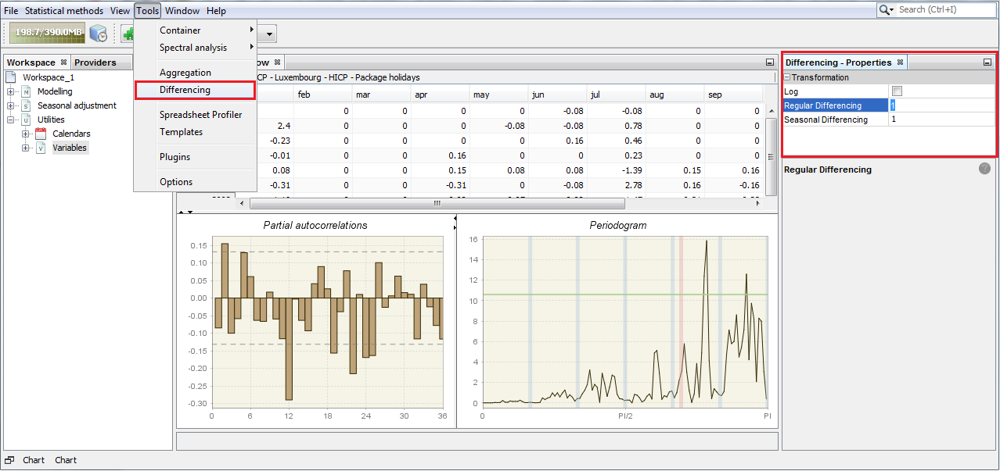

Figure 3.38: The properties of the *Differencing* tool.

The typical results are shown below. The bottom left graph presents
partial autocorrelation coefficients (vertical bars) and confidence
intervals. The right-click local menu offers several functionalities for
a differenced series. The explanation of available options can be found
below Figure 3 .29.

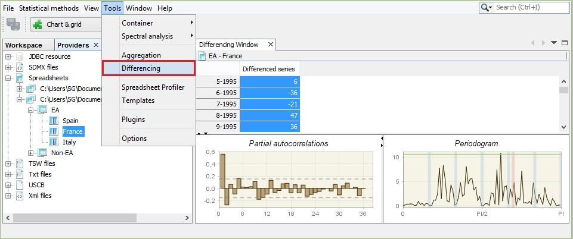

Figure 3.39: The *Differencing* tool.

For the *Partial autocorrelation* and the *Periodogram* panels the
right-button menu offers a copy series option that allows data to be
exported to the another application and a graph to be printed and saved
as a clipboard or as a jpg file. Information about the partial
autocorrelation function is given in 7.9. The description of a
periodogram is available in the ‘*JDemetra+ User Guide*’ (2017), item
3.4.2

### Spreadsheet profiler {#spreadsheet-profiler}

The *Spreadsheet profiler* offers the Excel-type view of the XLS file
imported to JDemetra+. To use this functionality drag the file name from
the *Providers* window and drop it the empty *Spreadsheet profiler*
window.

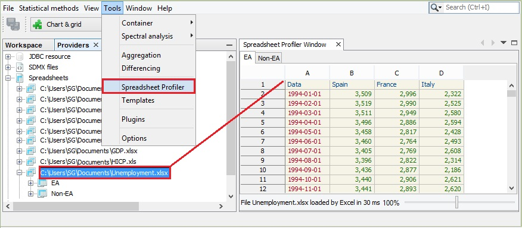

Figure 3.40: The *Spreadsheet Profiler* window.

### Plugins {#plugins}

JDemetra+ is an application that supports plug-ins. A plugin is a
software component that adds a specific feature to the existing software
application and is independent from the software version. It allows an
application to be enhanced without changing the original code. Plugins
can be shared between the users and installed individually. In this way
new functionalities can be easily distributed among seasonal adjustment
community members.

The *Plugins* window includes five panels: *Updates*, *Available
plugins*, *Downloaded*, *Installed* and *Settings*, some of them however
are not operational in the current version of the software.

The *Updates* panel offers the user the options for the manual check if
some updates of the already installed plugins are available. This
functionality, however, is currently not operational for the JDemetra+
plugins.

The *Available plugins* panel allows the downloading of all plugins that
are related to JDemetra+. This functionality, however, is currently not
operational for the JDemetra+ plugins.

The *Downloaded* panel is designed for installation of the new plugins
from the local machine. This process in explained in detail in Erreur :
source de la référence non trouvée.

The *Settings* panel is designated for adding the update centres, which
are the places to hold plugins. For each centre the user can specify
proxy settings and a time interval for the automatic checking for
updates. At the moment this functionality is not operational for the
JDemetra+ plugins.

### Options {#options}

The *Options* window includes five main panels: *Demetra*, *General*,
*Keymap*, *Appearance* and *Miscellaneous*. They are visible in the very
top of the *Options* window.

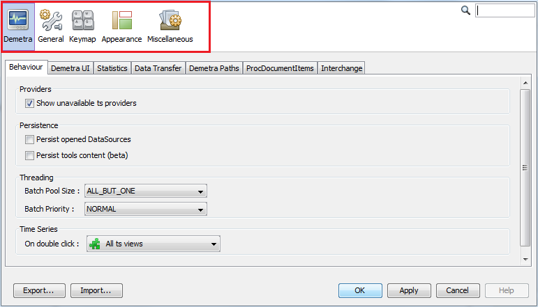

Figure 3.41: The main sections of the *Options* window.

By default, the *Demetra* tab is shown. It is divided into seven panels:
*Behaviour*, *Demetra UI*, *Statistics*, *Data transfer*, *Demetra
Paths*, *ProcDocumentItems*, and *Interchange*.

*Behaviour* defines the default reaction of JDemetra+ to some of the
actions performed by the user.

-   **Providers** – an option to show only the data providers that are
    currently available.

-   **Persistence** – an option to restore the data sources after
    re-starting the application so that there is no need to fetch them
    again (**Persist opened DataSources**) and an option to restore all
    the content of chart and grid tools (**Persist tools content**).

-   **Threading** – defines how resources are allocated to the
    computation (**Batch Pool Size** controls the number of cores used
    in parallel computation and **Batch Priority** defines the priority
    of computation over other processes). Changing these values might
    improve computation speed but also reduce user interface
    responsiveness.

-   **Time Series** – determines the default behaviour of the program
    when the user double clicks on the data. It may be useful to plot
    the data, visualise it on a grid, or to perform any pre-specified
    action, e.g. execute a seasonal adjustment procedure.

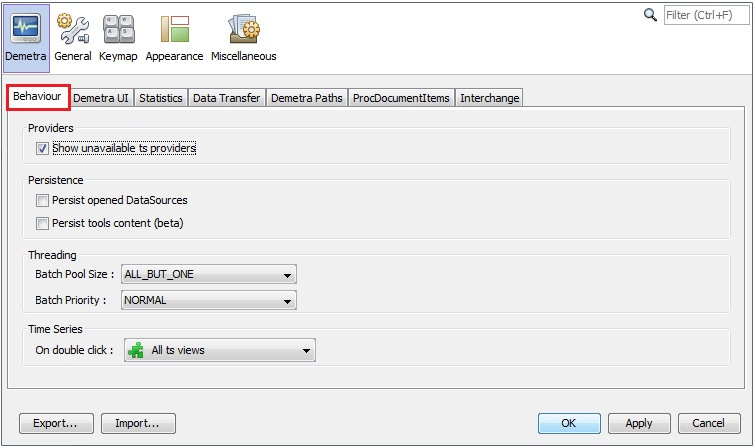

Figure 3.42: The content of the *Behavior* tab.

The *Demetra UI* tab allows for setting:

-   Default colour scheme for the graphs (**Color scheme**).

-   Data format (uses MS Excel conventions). For example,
    \#\#\#,\#\#\#.\#\#\#\# implies the numbers in the tables and the
    y-axis of the graphs will be rounded up to four decimals after the
    point (**Data format**).

-   Default number of last years of the time series displayed in charts
    representing growth rates (**Growth rates**).

-   Controls the view of the window for adding pre-specified outliers
    (**Pre-specified Outliers**)

-   Visibility of icons in the context menus (**Context Menus**).

Figure 3.43: The content of the *Demetra UI* tab.

The *Statistics* tab includes options to control:

-   The number of years used for spectral analysis and for model
    stability (**Default Number of Last Years**);

-   The default pre-defined specification for seasonal adjustment
    (**Seasonal Adjustment**);

-   The type of the analysis of revision history (**Revision History**):

    -   *FreeParameters* – the RegARIMA model parameters and regression
        coefficients of the RegARIMA model will be re-estimated each
        time the end point of the data is changed. This argument is
        ignored if no RegARIMA model is fit to the series.

    -   *Complete* – the whole RegARIMA model together with regressors
        will be re-identified and re-estimated each time the end point
        of the data is changed. This argument is ignored if no RegARIMA
        model is fit to the series.

    -   *None* – the ARIMA parameters and regression coefficients of the
        RegARIMA model will be fixed throughout the analysis at the
        values estimated from the entire series (or model span).

-   The settings for the quality measures and tests used in a diagnostic
    procedure:

    -   **Default components** – a list of series and diagnostics that
        are displayed in the **SAProcessing** \\(\rightarrow\\)
        **Output** window. The list of default items can be modified
        with the respective **Select** button (see Figure 3 .44: The
        Default components section on the Statistics tab.).

    -   **Diagnostics** – a list of diagnostics tests, for which the
        user can modify the default settings (see Figure 3 .45).

        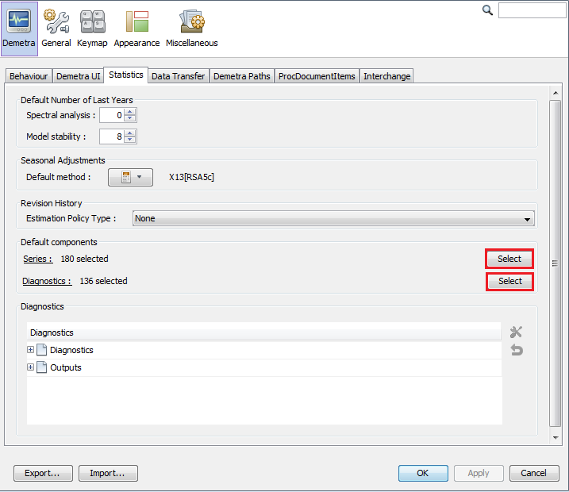

Figure 3.44: The *Default components* section on the *Statistics* tab.

The explanations for the list of series and diagnostics that are
displayed in the *Default components* section can be found under Erreur
: source de la référence non trouvée.

To modify the settings for a particular measure, double click on a
selected row (select the test’s name from the list and click on the
working tools button), introduce changes in a pop-up window and click
OK.

To reset the default settings for a given test, select this test from
the list and click on the backspace button situated below the working
tools button. The description of the parameters for each quality measure
and test used in a diagnostic procedure can be found in 7.12.

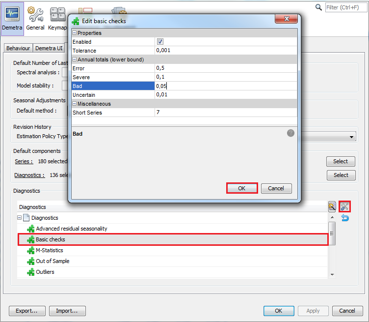

Figure 3.45: The panel for modification of the settings for the tests in
the *Basic checks* section.

The users can customize the diagnostics and they can specify the default
for the different outputs. Their preferences are saved between different
sessions of JD+. This new feature is accessible in the *Statistics* tab
of the *Options* panel.

Figure 3.46: The settings of the output files.

The *Data Transfer* tab contains multiple technologies that define the
behaviour of the drag and drop and copy-paste actions. To change the
default settings, double click on the selected item. Once the
modifications are introduced, confirm them with the *OK* button.

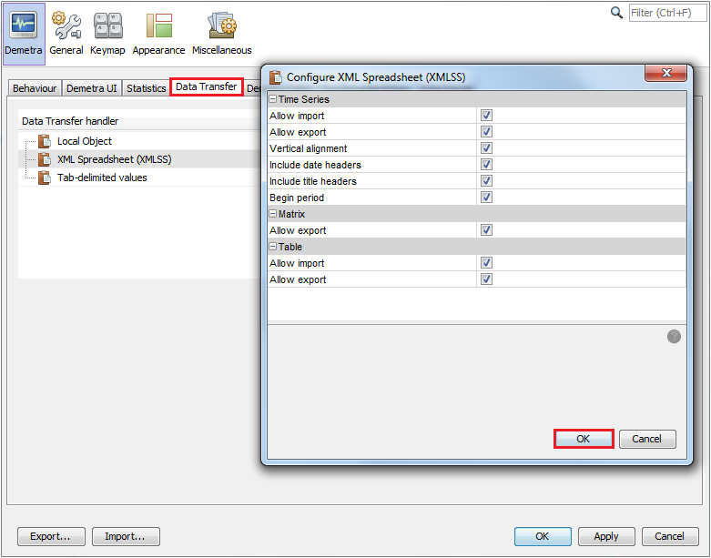

Figure 3.47: The content of the *Data Transfer* tab.

*Demetra Paths* allows the user to specify the relative location of the
folders where the data can be found. This way, the application can use
the data from different computers. Otherwise, the user would need to
have access to the exact path where the data is located. To add a
relative location, select the data provider, click “*+*” button and
specify the location.

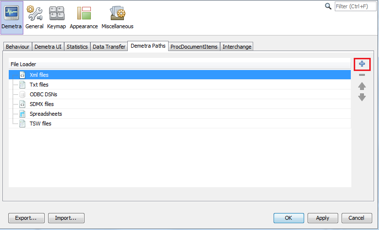

Figure 3.48: The content of the *Demetra Paths* tab.

*ProcDocumentItems* includes a list all reports available for processed
documents like seasonal adjustment. The *Interchange* tab lists the
protocols that can be used to exports/imports information like calendar,
specifications, etc. For the time being, the user cannot customize the
way the standard exchanges are done. However, such feature could be
implemented in plug-ins.

The next section, *General*, allows for a customisation of the proxy
settings. A proxy is an intermediate server that allows an application
to access the Internet. It is typically used inside a corporate network
where Internet access is restricted. In JDemetra+, the proxy is used to
get time series from remote servers like .Stat.

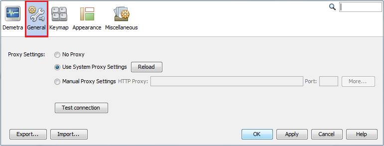

Figure 3.49: The *General* tab.

*Keymap* provides a list of default key shortcuts to access some of the
functionalities and it allows the user to edit them and to define
additional shortcuts.

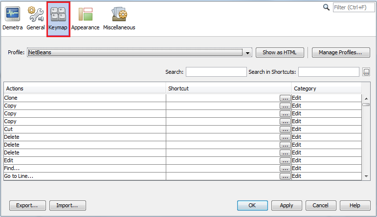

Figure 3.50: The *Keymap* tab.

The *Appearance* and *Miscellaneous* tabs are tabs automatically
provided by the Netbeans platform. They are not used by JDemetra+.

Window {#window}
------

The *Window* menu offers several functions that facilitate the analysis
of data and enables the user to adjust the interface view to the user’s
needs.

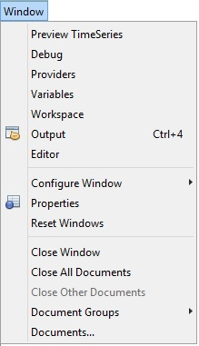

Figure 3.51: The *Window* menu.

-   **Preview Time Series** – opens a window that plots any of the
    series the user selects from *Providers*.

-   **Debug** – opens a *Preview Time Series* window that enable for
    fast display the graphs for time series from a large dataset. To
    display the graph click on the series in the *Providers* window.

-   **Providers** – opens (if closed) and activates the *Providers*
    window.

-   **Variables** – opens (if closed) and activates the *Variable*
    window.

-   **Workspace** – opens (if closed) and activates the *Workspace*
    window.

-   **Output** – generic window to display outputs in the form of text;
    useful with certain plug-ins (e.g. tutorial descriptive statistics).

-   **Editor** – activates the editor panel (and update the main menu
    consequently).

-   **Configure Window** – enables the user to change the way of display
    the window (maximise, float, float group, minimise, minimise group).
    This option is active when some window is displayed in the JD+
    interface.

-   **Properties** – opens the *Properties* window and displays the
    properties of the marked item (e.g. time series, data source).

-   **Reset Windows** – restores the default JDemetra+ view.

-   **Close Window** – closes all windows that are open.

-   **Close All Documents** – closes all documents that are open.

-   **Close Other Documents** – closes all documents that are open
    except for the one that is active (is the last activated one).

-   **Document Groups** – enables the user to create and manage the
    document groups.

-   **Documents** – lists all documents that are active.

   Help {#help}
----

The *Help* menu allows access to the documentation attached to software
(*Help Contents*). For JDemetra+ 2.2.0 no documentation is provided.
*About* includes basic information about JDemetra+, Java versions and
directories used by an application.

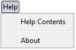

Figure 3.52: The *Help* menu.

RegArimaDoc {#regarimadoc}
-----------

*RegArimaDoc* is a main menu item that includes functionalities
designated for *RegArima* documents. To create a *RegArima* document
select *RegArima* from the *Statistical methods*
\\(\rightarrow\\)*Modelling* \\(\rightarrow\\) *Single Analysis* menu.

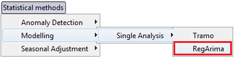

Figure 3.53: The *RegArima* menu item.

The *RegArimaDoc* item is displayed in the main menu of the application
when a newly created or existing *RegArima* document is active.

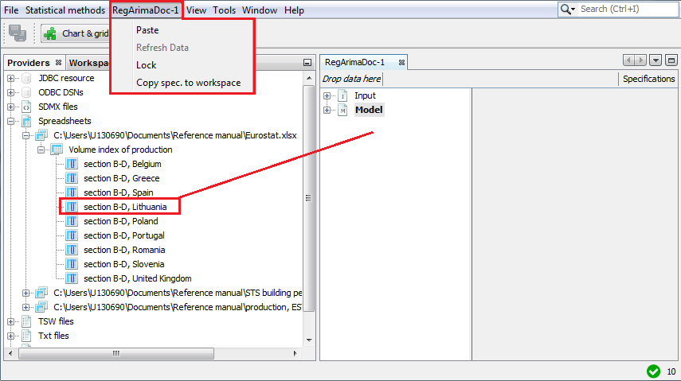

Figure 3.54: The *RegArimaDoc* menu for a newly created *RegArima*
document.

*RegArimaDoc-\#number* is a default name that corresponds to the
*RegArima* document’s name. The default name can be changed by the user
in the *Workspace* window (right click on *RegArimaDoc-\#number* under
the *regarima* node in the *Workspace* window and select rename from the
local menu).

The options for *RegArimaDoc* include:

-   **Paste** – pastes the time series to the *RegArimaDoc* window and
    performs seasonal adjustment for this time series using settings
    selected for the current process. The series need to be previously
    copied, e.g. from the *Providers* window. Otherwise the message
    informing that the action cannot be done is displayed.

-   **Refresh data** – updates the input data and executes the seasonal
    adjustment process. This option is only available for *RegArimaDoc*
    documents saved during a previous session with JDemetra+. To use
    this option, first create *RegArimaDoc* document and drag and drop
    the time series into it. Then save the workspace and close
    JDemetra+. Next, update the time series (add/change the
    observations, but do not change neither the localisation of the file
    nor the file name) and open JDemetra+ once again. Open the
    previously saved workspace and double click on the respective
    *RegArima* document in the *Workspace* window. Finally, chose the
    **Refresh data** option from the *RegArimaDoc* menu. JDemetra+
    re-estimates the complete seasonal adjustment model automatically,
    so the results are updated immediately. The user can modify the
    specification and validate the newly introduced changes using the
    *Specifications* functionality (see 4.1).

-   **Lock** – prevents the series from the *RegArimaDoc* from being
    changed when the user double clicks on a new one in the *Providers*
    window. However, with this option the user can still change
    specification’s settings.

-   **Copy spec**. **to workspace** – copy the specification of the
    active document into the workspace. In that way, it can be used for
    other processing.

 X13Doc {#x13doc}
------

*X13Doc* is a main menu item that includes functionalities designated
for *X13* documents. To create a *X13* document select *X13* from the
*Statistical methods* \\(\rightarrow\\) *Single Analysis* menu.

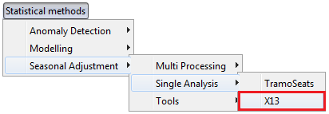

Figure 3.55: The *X13* menu item.

The *X13doc* item is displayed in the main menu of the application when
a newly created or existing *X13* document is active.

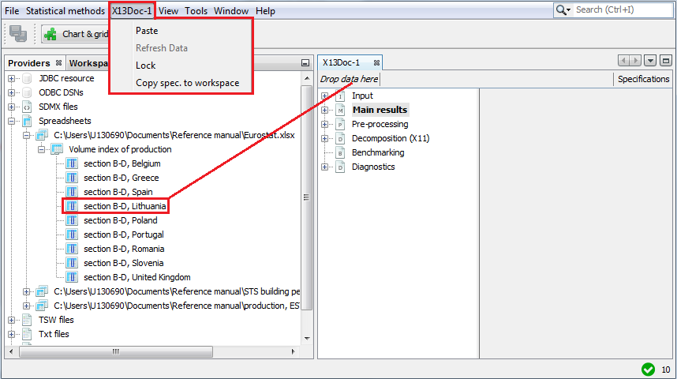

Figure 3.56: The *X13Doc* menu for a newly created X13 document.

*X13Doc-\#number* is a default name that corresponds to the *X13*
document’s name. It is updated automatically, once the relevant *X13*
document is renamed.

The options for the *X13Doc* include:

-   **Paste** – pastes the time series to the *X13Doc* window and
    performs seasonal adjustment for this time series using settings
    selected for the current process. The series need to be previously
    copied, e.g. from the *Providers* window. Otherwise the message
    informing that the action cannot be done is displayed.

-   **Refresh data** – updates the input data and executes the seasonal
    adjustment process. This option is only available for *X13*
    documents saved during a previous session with JDemetra+. To use
    this option, first create *X13* document and drag and drop the data
    into it. Then save the workspace and close JDemetra+. Next, update
    the time series (add/change the observations, but do not change
    either the localisation of the file or the file name) and open
    JDemetra+ once again. Open the previously saved workspace and double
    click on the respective *X13* document in the *Workspace* window.
    Finally, chose the **Refresh data** option from the *X13Doc* menu.
    JDemetra+ re-estimates the complete seasonal adjustment model
    automatically, so the results are updated immediately. The user can
    modify the specification and validate the newly introduced changes
    using the *Specification* functionality (see 4.1 and 5.1).

-   **Lock** – prevents the series from the *X13Doc* from being changed
    when the user double clicks on a new one in the *Providers* window.
    However, with this option the user can still change the
    specification’s settings.

-   **Copy spec**. to workspace – copy the specification of the active
    document into the workspace. In that way, it can be used for other
    processing.

TramoDoc  {#tramodoc}
---------

*TramoDoc* is a main menu item that includes functionalities designated
for *Tramo* documents. To create a *Tramo* document select *Tramo* from
*the Statistical methods* \\(\rightarrow\\)*Modelling* \\(\rightarrow\\)
*Single Analysis* menu.

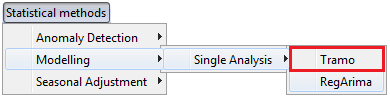

Figure 3.57: The *Tramo* item.

The *TramoDoc* is displayed in the main menu of the application when a
newly created or existing *Tramo* document is active.

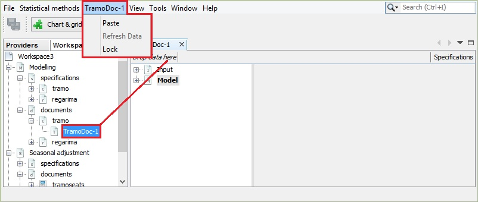

Figure 3.58: The *TramoDoc* menu for a newly created X13 document.

*TramoDoc*-*\#number* is a default name that corresponds to the *Tramo*
document’s name. It is updated automatically, once the relevant *Tramo*
document is renamed.

The options for the *TramoDoc* include:

-   **Paste** – pastes the time series to the *TramoDoc* window and
    performs seasonal adjustment for this time series using settings
    selected for the current process. The series need to be previously
    copied, e.g. from the *Providers* window. Otherwise the message
    informing that the action cannot be done is displayed.

-   **Refresh data** – updates the input data and executes the seasonal
    adjustment process. This option is only available for *Tramo*
    documents saved during previous session with JDemetra+. To use this
    option, first create *Tramo* document and drag and drop the data
    into it. Then save the workspace and close JDemetra+. Next, update
    the time series (add/change the observations, but do not change
    neither the localisation of the file nor the file name) and open
    JDemetra+ once again. Open the previously saved workspace and double
    click on the respective *Tramo* document in the *Workspace* window.
    Finally, chose the **Refresh data** option from the *TramoDoc* menu.
    JDemetra+ re-estimates the complete seasonal adjustment model
    automatically, so the results are updated immediately. The user can
    modify the specification and validate the newly introduced changes
    using the *Specification* functionality (see 4.1).

-   **Lock** – prevents the series from the *TramoDoc* from being
    changed when the user double clicks on a new one in the *Providers*
    window. However, with this option the user can still change
    specification’s settings.

-   **Copy spec**. to workspace – copy the specification of the active
    document into the workspace. In that way, it can be used for other
    processing.

  TramoSeats doc {#tramoseats-doc}
--------------

*TramoSeatsDoc* is a default name for the main menu item that includes
functionalities designated for *TramoSeats* documents. To create a
*TramoSeats* document select *TramoSeats* from the *Statistical methods*
\\(\rightarrow\\) *Single Analysis* menu.

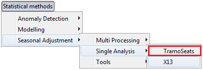

Figure 3.59: the *TramoSeats* menu item.

The *TramoSeatsDoc* item is displayed in the main menu of the
application when a newly created or existing *TramoSeats* document is
active.

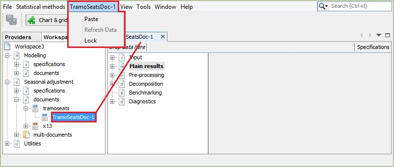

Figure 3.60: The *TramoSeatsDoc* menu for a newly created X13 document.

*TramoSeatsDoc* is a default name that corresponds to the *TramoSeats*
document’s name. It is updated automatically, once the relevant
*TramoSeats* document is renamed.

The options for the *TramoSeatsDoc* include:

-   **Paste** – pastes the time series to the *TramoSeatsDoc* window and
    performs seasonal adjustment for this time series using settings
    selected for the current process. The series need to be previously
    copied, e.g. from the *Providers* window. Otherwise the message
    informing that the action cannot be done is displayed.

-   **Refresh data** – updates the input data and executes the seasonal
    adjustment process. This option is only available for *TramoSeats*
    documents saved during a previous session with JDemetra+. To use
    this option, first create *TramoSeats* document and drag and drop
    the data into it. Then save the workspace and close JDemetra+. Next,
    update the time series (add/change the observations, but do not
    change neither the localisation of the file nor the file name) and
    open JDemetra+ once again. Open the previously saved workspace and
    double click on the respective *TramoSeats* document in the
    *Workspace* window. Finally, chose the **Refresh data** option from
    the *TramoSeatsDoc* menu. JDemetra+ re-estimates the complete
    seasonal adjustment model automatically, so the results are updated
    immediately. The user can modify the specification and validate the
    newly introduced changes using the *Specification* functionality
    (see 4.1 and 5.1).

-   **Lock** – prevents the series from the *TramoSeatsDoc* from being
    changed when the user double clicks on a new one in the *Providers*
    window. However, with this option the user can still change
    specification’s settings.

-   **Copy spec. to workspace** – copy the specification of the active
    document into the workspace. In that way, it can be used for other
    processing.

[^1]: Eurostat is the statistical office of the European Union. Its task
    is to provide the European Union with statistics at European level
    that enable comparisons between countries and regions. More
    information is available at [http://epp.eurostat.ec.europa.eu/portal/page/portal/eurostat/home/](http://epp.eurostat.ec.europa.eu/portal/page/portal/eurostat/home/).

[^2]: X-12-ARIMA is a seasonal adjustment program developed and
    supported by the U.S. Census Bureau. It includes all the
    capabilities of the X-11 program (see DAGUM, E.B. (1980)), which
    estimates trend and seasonal component using moving averages.
    X-12-ARIMA offers useful enhancements including: extension of the
    time series with forecasts and backcasts from the ARIMA models prior
    to seasonal adjustment, adjustment for effects estimated with
    user-defined regressors, additional seasonal and trend filter
    options, alternative seasonal-trend-irregular decomposition,
    additional diagnostics of the quality and stability of the
    adjustments, extensive time series modelling and model selection
    capabilities for linear regression models with ARIMA errors. For
    basic information on the X-12-ARIMA program see ‘*X-12-ARIMA
    Reference Manual*’ (2011). More information on X-12-ARIMA can be
    found at [http://www.census.gov](http://www.census.gov/).

[^3]: X-13ARIMA-SEATS is a seasonal adjustment program developed and
    supported by the U.S. Census Bureau that contains two seasonal
    adjustment modules: the enhanced X-11 seasonal adjustment procedure
    and an ARIMA model based seasonal adjustment procedure from the
    SEATS seasonal adjustment program developed by GÓMEZ, V., and
    MARAVALL, A. (2013). For information on the X-13ARIMA-SEATS program
    see ‘*X-13ARIMA-SEATS Reference Manual*’ (2015). More information on
    X-13ARIMA-SEATS can be found at [http://www.census.gov](http://www.census.gov/).

[^4]: TRAMO/SEATS is a model-based seasonal adjustment method developed
    by Victor Gómez and Agustin Maravall (the Banco de España*).* It
    consists of two linked programs: TRAMO and SEATS. TRAMO ("Time
    Series Regression with ARIMA Noise, Missing Observations, and
    Outliers") performs estimation, forecasting, and interpolation of
    regression models with missing observations and ARIMA errors, in the
    presence of possibly several types of outlier. SEATS ("Signal
    Extraction in ARIMA Time Series") performs an ARIMA-based
    decomposition of an observed time series into unobserved components.
    Both programs are supported by the Banco de España. For basic
    information on the TRAMO/SEATS see CAPORELLO, G., and MARAVALL, A.
    (2004). More information on TRAMO/SEATS can be found at [www.bde.es](http://www.bde.es/).

[^5]: For description of the ARIMA model see 7.2.1.

[^6]: MARAVALL, A., CAPORELLO, G., PÉREZ, D., and LÓPEZ, R. (2014).

[^7]: Documentation on Win X-X13 can be found on: [https://www.census.gov/srd/www/winx13/WinX13Doc.html](https://www.census.gov/srd/www/winx13/WinX13Doc.html).

[^8]: (2015), ‘*X-13ARIMA-SEATS Quick Reference for Unix\\Linux*’*.*

[^9]: Endorsed by the Statistical Programme Committee, the European
    Statistical System (ESS) ‘*Guidelines on Seasonal Adjustment*’
    (2009) aim to harmonize European practices and to improve the
    comparability of infra-annual national statistics as well as enhance
    the overall quality of the European Union and the euro area
    aggregates. The ‘*ESS Guidelines on Seasonal Adjustment*’ (2009) and
    its revised version released in 2015 cover all the key steps of the
    seasonal and calendar adjustment process. They discuss both the
    theoretical aspects and practical implementation of seasonal
    adjustment issues.

[^10]: GRUDKOWSKA, S. (2015).

[^11]: See https://netbeans.org/.

[^12]: CAPORELLO, G., and MARAVALL, A. (2004).
