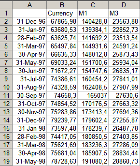
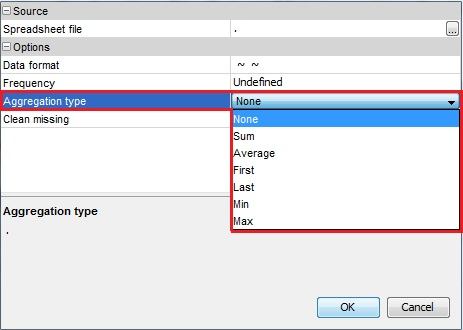
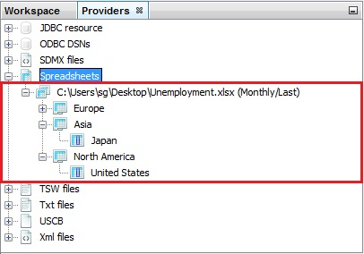
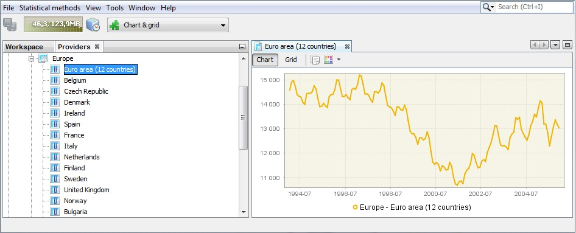

About JDemetra+ User Guide {#about-jdemetra-user-guide}
--------------------------

This document aims to introduce users to the main features of JDemetra+
enabling them to take advantage of this program and understand the
output from consecutive steps of the analysis. The document includes
step-by-step descriptions of how to perform a typical analysis and
useful tips that facilitate replication of the results with user’s own
data and working instructions. The *JDemetra+ User Guide* does not cover
all available JDemetra+ functionalities. They are included in the
*JDemetra+ Reference Manual* (2017) and the user should refer to it for
necessary information.

It is assumed that the reader is familiar with concepts, such as *time
series*, *trend-cycle*, *seasonality*, *descriptive statistics*,
*confidence level*, *mean square error*, *estimate*, *estimator*,
*linear regression, stationarity*, *ARIMA process* and so on. Readers
with insufficient background to follow this document are encouraged to
refer to an appropriate textbook, e.g. Chatfield (2004). Some background
knowledge about seasonality in the time series can be gained from the
e-learning courses on Seasonal Adjustment that are available at [http://www.sa-elearning.eu/](http://www.sa-elearning.eu/).

JDemetra+ uses the notation "X12", "X13","Arima", "RegArima" and
"TramoSeats" instead of "X-12-ARIMA", "X-13ARIMA-SEATS", "ARIMA",
"RegARIMA" and "TRAMO/SEATS" respectively. This notation is also used in
the *JDemetra+ User Guide* when the references to the user interface are
made.

### Who should use this document? {#who-should-use-this-document}

With JDemetra+, which is an extremely user-friendly software,
pre-adjustment and decomposition of a time series can be performed
easily by users who have absolutely no knowledge of seasonal adjustment
theory. Although the output is easy to produce, its analysis,
interpretation, readjustment and validation requires certain knowledge
and practice. Therefore the *JDemetra+ User Guide* is designed for two
types of users: beginners, who have only a basic knowledge of
seasonality and its estimation in time series, and advanced users, who
already perform seasonal adjustment and are able to interpret the
outcomes, at least on a basic level.

This *User Guide* neither describes in detail how the seasonal
adjustment methods work, nor the underlying mathematics. For those
readers interested in studying seasonal adjustment methods a brief
sketch of the X-13ARIMA-SEATS and TRAMO/SEATS algorithms and concepts as
well as a bibliography are included in the *JDemetra+ Reference Manual*
(2017).

### How the document is organized {#how-the-document-is-organized}

The *JDemetra+ User Guide* is divided into three parts.

Chapter 1 is designed to present general information about JDemetra+
including an installation procedure. It also gives guidance on the
intended use of the document.

Chapter 2 includes general overview of the program and information
concerning dealing with data. It deals with issues such as preparation
of dataset and importing it to JDemetra+. In general, these preliminary
steps are to be performed in each scenario.

Chapter 3 presents step-by-step scenarios described in 1.3.3 and is
divided into subchapters that correspond to the consecutive scenarios.
The choice of the scenario should be based on the user’s knowledge of
seasonal adjustment and skill in time series analysis. This chapter
refers to specific parts of the *JDemetra+ Reference Manual* (2017) and
in this way guides the user throughout the whole document.

### How to use this document {#how-to-use-this-document}

With JDemetra+ seasonal adjustment can be performed in several ways.
Additional functionalities designed for time series analysis, not
necessarily strictly related to seasonal adjustment are also provided.

The *JDemetra+ User Guide* offers several typical paths that can be
followed to perform analyses in an efficient way. These scenarios are
designed to account for different user aims and common constraints, such
as the time allocated to perform the task, the size of the dataset and
the user’s experience and skill in seasonal adjustment. Each scenario
includes consecutive phases of analysis from preparing the source data
to the investigation of the results, readjusting and regular data
production. Therefore it is recommended to study each scenario from
beginning to the end.

There are nine scenarios in total: four on seasonal adjustment, two on
time series modelling, one on tests for seasonality one on spectral
analysis and one on calendars. The four scenarios on seasonal adjustment
consist of two simple scenarios for beginners and users with limited
time for performing seasonal adjustment and two scenarios of more
detailed seasonal adjustment for more experienced users. The simple and
detailed scenarios both have one example of analysing a single time
series and one example of analysing multiple time series. These
scenarios can be found in section 3.

There are two time series modelling scenarios, one advanced and one
basic that give examples of analysing time series characteristics. The
scenario for advanced users provides a detailed analysis that includes
identification and estimation of outliers[^1], calendar effects[^2],
interpolation of missing values and forecasting. The basic scenario is a
limited version of the advanced analysis, focused mostly on automatic
detection of outliers and calendar effects.

A scenario on seasonality tests is for all types of users and explains
how to test for the presence of seasonal movements in time series. The
presence of seasonality should be checked for each time series in a
dataset. The tests for seasonality are integral to the seasonal
adjustment procedures available in JDemetra+. However, the tests can be
run independently of seasonal adjustment. The scenario on seasonality
tests serves this purpose. As it is designed for analysis of a single
time series, it is usually run for the detailed analysis of the most
important series. For example, it can be used for checking the presence
of seasonal movements to decide if a series should be seasonally
adjusted or for regular monitoring of seasonality in time series.

The spectral graphs scenario is for advanced users and introduces
in-depth analysis of a time series in the frequency domain.

The calendars scenario explains how to define country-specific holidays
and include them into a national calendar. It also deals with the more
sophisticated types of calendar and explains how to import them.

Preliminary issues: uploading and visualizing data {#preliminary-issues-uploading-and-visualizing-data}
==================================================

### Overview of the JDemetra+ {#overview-of-the-jdemetra}

The installation procedure and system requirements are discussed in the
*JDemetra+ Reference Manual* (2017), section 1.2.

The default view of JDemetra+ window, which is displayed after launching
the program, is shown below.

> 

Figure 2.1: JDemetra+ default window.

The majority of functionalities are available from the menu of the
application, which is situated at the very top of the main window. If
the user moves the cursor to an entry in the main menu and clicks on the
left mouse button, a drop-down menu will appear. Clicking on an entry in
the drop-down menu selects the highlighted item. Some of the functions
available in the menu of the application are described in the Chapter 3.

> 

Figure 2.2: The main menu.

The *Browsers* panel presents the list of the data sources and organizes
the imported series within each data providers.

> 

Figure 2.3: The *Workspace* window.

The *Workspace* window organizes all default and user-defined
specifications (see the *JDemetra+ Reference Manual* (2017), item 2.2),
documents and calendars defined. It is divided into three sections:
*Modelling, Seasonal adjustment* and *Utilities*. The *Modelling*
section contains a set of pre-defined specifications that enables to
model the time series using two options: the TRAMO model or the RegARIMA
model. The user can add new specifications by choosing *New* from the
pop-up menu (right click on the name of the modelling option). It is
also possible to create a document attached to the given specification.
It can be done by choosing an option *Create Document.*

The *Seasonal adjustment* section contains a set of pre-defined
specifications that enables to seasonally adjust the time series using
two methods: TRAMO/SEATS or X-13ARIMA-SEATS. The user can add new
specifications by choosing *New* from the pop-up menu (right click on
the name of the seasonal adjustment option). It is also possible to
create a document resulting from a given specification. It can be done
by choosing an option *Create Document*.

Finally, the *Utilities* section presents all variables and calendars
prepared by the user. By default, this node contains only a *Default*
calendar (3.4.3).

A blank zone on the right is designated for displaying the actual
analyses.

> 

Figure 2.4: The *Providers* window.

Example data files are available at [www.cros-portal.eu](http://www.cros-portal.eu/).
To open the file, right-click on the appropriate provider from the
*Providers* panel and specify the data source. The procedure for all
providers follows the same logic. Examples of loading data for each
provider type are presented in this chapter.

### Source data {#source-data}

JDemetra+ deals with several data sources. The allowed data sources
include:

-   JDBC;

-   ODBC;

-   SDMX;

-   Spreadsheets;

-   TSW files;

-   TXT;

-   USCB files;

-   XML.

All standard databases (Oracle, SQLServer, DB2, MySQL) are supported by
JDemetra+ via JDBC, which is a generic interface to many relational
databases. Other providers can be added by users by creating plugins.

#### Spreadsheets {#spreadsheets}

The Spreadsheets data source corresponds to the series prepared in the
Excel file. The file should have true dates in the first column (or in
the first row) and titles of the series in the corresponding cell of the
first row (or in the first column). The top-left cell \[A1\] can include
a text or it can be left empty. The empty cells are interpreted by
JDemetra+ as missing values and they can appear in the beginning, in the
middle and in the end of time series.

An example is presented below:

> 

Figure 2.5: Example of an Excel spreadsheet that can be imported to
JDemetra+.

Time series are identified by their names. JDemetra+ derives some
information (like data periodicity, starting and ending period) directly
from the first column (or from the first row, depending on the chosen
data orientation (vertical or horizontal)).

### Import data {#import-data}

To import data from a given data source, click on this data source in
the *Providers* window (2.1.1), choose *Open* option and specify the
import details, such as a path to a data file. These details vary
according to data providers. The scenario below presents how to import
the data from an Excel file.

1.  From the *Providers* window right-click on the *Spreadsheets* branch
    and choose *Open* option.

> 
>
> Figure 2.6: Data provider available by default.

1.  The *Open data source* window contains the following options:

-   *Spreadsheet file* – a path to access the Excel file.

-   *Data format* – the data format used to read dates and values. It
    includes three fields: *locale* (country), *date pattern* (data
    format, e.g. *yyyy-mm-dd*), *number pattern* (a metaformat of
    numeric value, e.g. 0.\#\# represents two digit number).

-   *Frequency* – time series frequency. This can be undefined, yearly,
    half-yearly, four-monthly, quarterly, bi-monthly, or monthly. When
    the frequency is set to undefined, JDemetra+ determines the time
    series frequency by analysing the sequence of dates in the file.

-   *Aggregation type* – the type of aggregation (over time for each
    time series in the dataset) for the imported time series. This can
    be *None*, *Sum*, *Average*, *First*, *Last*, *Min* or *Max*. The
    aggregation can be performed only if the *frequency* parameter is
    specified. For example, when frequency is set to *Quarterly* and
    aggregation type is set to *Average*, a monthly time series is
    transformed to quarterly one with values that are equal to the one
    third of the sum of the monthly values that belong to the
    corresponding calendar quarter.

-   *Clean missing* – erases the missing values of the series.

Next, in the *Source* section click the grey "...." button (see below)
to open the file.

> 
>
> Figure 2.7: Data source window.

1.  Choose a file and click *OK*.

> 

Figure 2.8: Choice of an Excel spreadsheet.

1.  The user may specify *Data format*, *Frequency* and *Aggregation
    type*, however this step is not compulsory. When these options are
    specified JDemetra+ is able to convert the time series frequency.
    Otherwise, the functionality that enables converting the time series
    frequency will not be available.

> 
>
> Figure 2.9: Options for importing data.

1.  The data are organized in a tree structure.

> 
>
> Figure 2.10: Dataset structure.

### Displaying data {#displaying-data}

<!-- -->

1.  To display a given series right click on it and chose the *Chart &
    grid* option from the local menu. The graph is displayed in the
    panel on the right.

> 
>
> Figure 2.11: Time series graph.

1.  Using the local menu that is available for the chart the user may
    adjust the view of the picture, save it and/or save it in a given
    location.

> 
>
> Figure 2.12: Local menu basic options for the time series graph.

1.  Once the time series is marked by clicking on it with the left mouse
    button, more sophisticated options are available, in addition to the
    standard ones shown in Figure 2.12.

> 
>
> Figure 2.13: Full local menu options.

1.  These additional options include the *Open with* option, which opens
    time series in a separate window according to the user choice (chart
    & grid or only chart). *All ts views* option is not available at the
    moment. The picture below shows the view displayed once *Chart &
    grid* option was chosen. By clicking on the marked buttons the user
    can switch between chart and grid view. For both views (chart and
    grid) the local menu is available.

> 
>
> Figure 2.14: *Chart & grid* view.

1.  *Rename* option (see Figure 2.12) enables to change the time series
    name.

> 

Figure 2.15: Renaming a time series.

1.  The option *Split into the yearly components* opens an additional
    window that presents the analysed series data split by year. This
    chart is useful to investigate the differences in time series values
    caused by the seasonal factors. The graph gives some idea about the
    existence and size of deterministic and stochastic seasonality in
    data.

> 
>
> Figure 2.16: *Split into the yearly components* option’s result.

1.  To display more than one series on the graph, select *Tools* →
    *Container* → *Chart* from the main menu. Next, drag a drop series
    to the *Chart* window. Local menu options are available.

> 
>
> Figure 2.17: *Chart* window.

Seasonal adjustment and other time-series analysis with JDemetra+ {#seasonal-adjustment-and-other-time-series-analysis-with-jdemetra}
=================================================================

The aim of this chapter is to introduce the main functionalities of
JDemetra+. This chapter uses a step-by-step approach to the primary
features of JDemetra+. It presents typical scenarios for time series
analysis and shows the paths to follow with appropriate references to
other parts of the *JDemetra+ Reference Manual* (2017) so that the user
can adjust the scenario to his or her own needs.

The scenarios presented here are intended for different types of users –
both advanced ones and beginners. The user is advised to select
scenarios that match his or her level of experience and skills in
seasonal adjustment and time series modelling. These scenarios include:

-   **Simple seasonal adjustment of a single time series** – a path
    designed for beginners that explains how to perform seasonal
    adjustment using pre-defined specifications for a single time
    series.

-   **Simple seasonal adjustment of multiple time series** – a path
    designed for beginners that explains how to perform seasonal
    adjustment using pre-defined specifications for multiple time series
    in a dataset.

-   **Detailed seasonal adjustment of a single time series** – a path
    designed for advanced users that shows an in-depth analysis of
    seasonal adjustment results for a single time series generated by
    user-defined specifications.

-   **Detailed seasonal adjustment of multiple time series** – a path
    designed for advanced users that shows an in-depth analysis of
    seasonal adjustment results for a multiple time series generated by
    user-defined specifications.

-   **Basic time series analysis** – a path designed for beginners
    showing automatic detection of outliers and calendar effects in a
    time series.

-   **Advanced time series analysis** – a path designed for advanced
    users that includes user identification and estimation of outliers
    and calendar effects, interpolation of missing values and
    forecasting.

-   **Seasonality tests** – a path designed for all users describing how
    to test for the presence of seasonal movements in time series.

-   **Spectral graphs** – a path designed for advanced users for the
    in-depth analysis of time series in the frequency domain.

-   **Calendars** – a path designated for all users which explains how
    to include the country-specific holidays into a calendar.

Before executing a scenario, install JDemetra+, run the program (see
*JDemetra+ Reference Manual* (2017), section 1.2) and import the data
following the instruction from the section 2.1.3.

[^1]: See 3.2.1.3 for a definition and *JDemetra+ Reference Manual*
    (2017), item 7.1.1 for more information.

[^2]: See 3.4.3 for a definition and *JDemetra+ Reference Manual*
    (2017), item 7.2 for more information.
